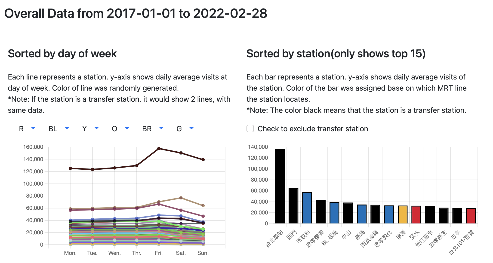

# Taipei MRT visits Data Visualization Project

## Introduction

Taipei metro system plays a vital role in public transport network at Taipei, Taiwan.It handled a record of 26 million passengers in 2019. Although statics about footfalls are online-available nowadays, there hasn’t been a website or application that visualize those data. By visualize Taipei MRT visits data, it may benefits to people who are interested.

## Propose

This project is meant to visualize visits to MRT stations located at Taipei, Taiwan.In my current goal, it would including functions include but not limited to:

- Include/Exclude specific stations
- Select Data between date duration

and data were present:

- Daily
- By day of week
- Monthly
- Yearly

## Preliminary result

Daily results of all stations can be shown in one line chart. Each station/MRT-line can be individually include/excluded. Time interval can be set to fetch data during specific duration. Stations are grouped based on which MRT line it's on.
Overall data sorted by day of week and station itself was demonstrated below.

## Tools used in this project

- Programing language
    - Java
    - HTML
    - Javascript
- Framework
    - Spring Boot
- Javascript library
    - [Chart.js](https://www.chartjs.org/)
    - [Bootstrap 5](https://getbootstrap.com/docs/5.0/getting-started/introduction/)
    - [Luxon](https://moment.github.io/luxon/#/)
- Website
    - [Mockaroo](https://www.mockaroo.com/apis): Mock APIs
    - [Heroku Data](https://data.heroku.com/): PostgreSQL database deployment

## Resource:

Data source: [repo](https://github.com/ker07/downloadMRTData)